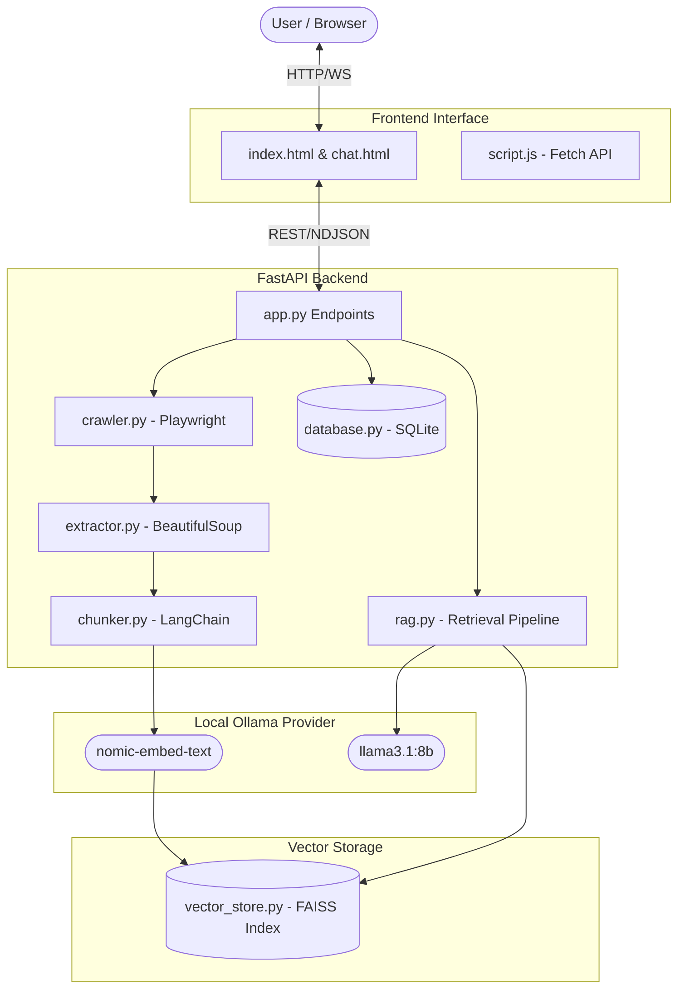
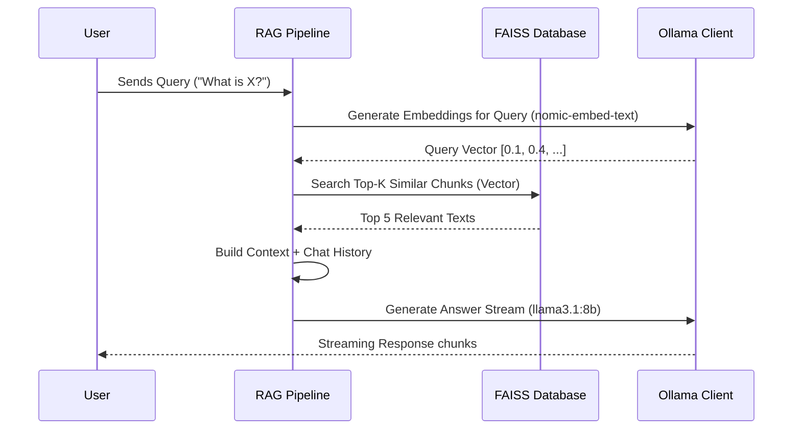
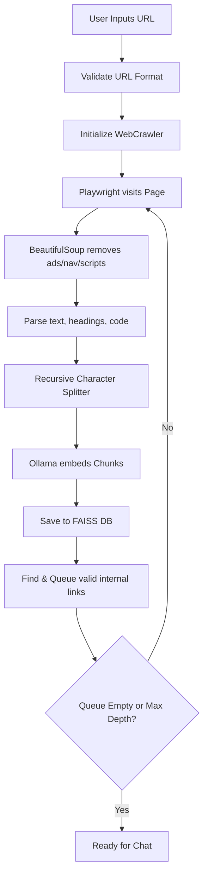
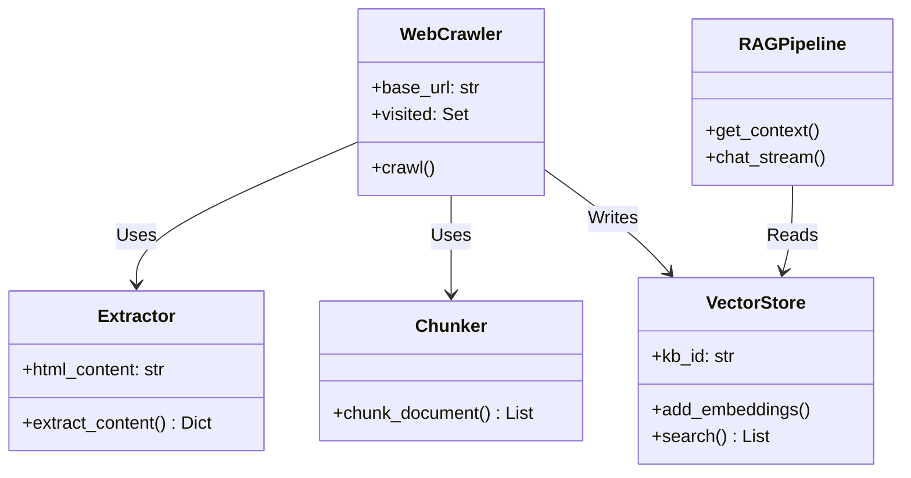

# RAG-Powered Website Chatbot using Ollama

## Project Overview
The RAG-Powered Website Chatbot is a production-quality, local-first application designed to recursively crawl any given website, extract meaningful content, embed it locally using Ollama's `nomic-embed-text`, and enable intelligent conversational retrieval using FAISS and `llama3.1:8b`. The system features a modern, animated "Warm Yellow" UI, built entirely on local AI models to ensure privacy, zero external API costs, and low latency.

---

## 🏗 System Architecture Diagram



---

## ⚙️ Installation & Setup

1. **Clone the Repository**
2. **Install Requirements**
   ```bash
   pip install -r requirements.txt
   playwright install chromium
   ```
3. **Start Ollama Models**
   Ensure Ollama is installed on your system.
   ```bash
   ollama pull llama3.1:8b
   ollama pull nomic-embed-text
   ```
4. **Run the Backend**
   ```bash
   uvicorn backend.app:app --reload
   ```
5. **Open the Frontend**
   Open `frontend/index.html` in your web browser.

---

## 📂 Folder Structure

```text
.
├── requirements.txt
├── backend/
│   ├── __init__.py
│   ├── config.py
│   ├── app.py
│   ├── models.py
│   ├── crawler.py
│   ├── extractor.py
│   ├── chunker.py
│   ├── embedder.py
│   ├── vector_store.py
│   ├── rag.py
│   ├── ollama_client.py
│   ├── chat_memory.py
│   ├── database.py
│   └── utils.py
├── frontend/
│   ├── index.html
│   ├── chat.html
│   ├── style.css
│   ├── script.js
└── README.md
```

---

## 🖼 Screenshots

*(Placeholders for screenshots)*
- **Homepage:** ``
- **Chat Interface:** ``

---

## 🧠 How RAG Works



---

## 🕷 How Crawling Works



---

## 📘 API Documentation

### 1. `POST /crawl`
Initializes background crawling for a website.
**Body:** `{"url": "https://example.com"}`
**Response:** `{"message": "Crawling started", "kb_id": "md5_hash"}`

### 2. `GET /status?kb_id={id}`
Returns crawling progress.
**Response:** `{"kb_id": "...", "status": "crawling", "pages_crawled": 10, "chunks_created": 45}`

### 3. `POST /chat`
Conversational RAG endpoint (Returns NDJSON streaming).
**Body:** `{"message": "Hello", "kb_id": "...", "session_id": "..."}`

### 4. `DELETE /delete?kb_id={id}`
Deletes FAISS index and DB records for a knowledge base.

---

## 📐 Class Diagram



---

## 🚀 Future Improvements

- **Multi-Tenant System:** Allow user accounts to manage their own knowledge bases securely.
- **WebSockets:** Upgrade the frontend-backend communication from HTTP Polling to WebSockets for live crawler updates.
- **Advanced Chunking:** Implement Semantic Chunking instead of fixed-length Recursive split.
- **Graph RAG:** Extract entities and relationships during crawling to power Graph RAG queries.


TO RUN : python -m uvicorn backend.app:app --port 8000 --reload
